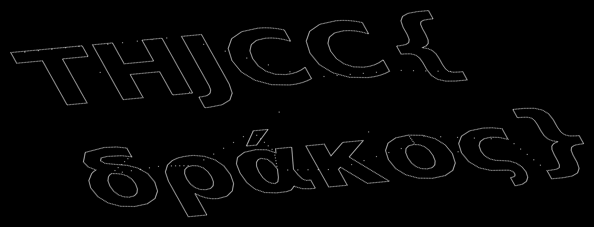

# All night long...

## Challenge Information

| Field | Value |
| --- | --- |
| Category | Miscellaneous |
| Points | 337 |
| Author | MaZon |
| Original handout | [`artifacts/chal.zip`](artifacts/chal.zip) |
| Extracted audio | [`artifacts/signal.wav`](artifacts/signal.wav) |
| Recovered image | [`artifacts/recovered.png`](artifacts/recovered.png) |
| Solver | [`solve.py`](solve.py) |
| Flag | `THJCC{δράκος}` |

> 一天不聽難受 聽了難受一天 嚴肅看待

## TL;DR

The WAV file contains ordinary audio around a harsh, periodic stereo burst. The
burst is not a spectrogram picture or an LSB payload. It is a pair of
oscilloscope coordinate streams:

- one channel supplies the X coordinate;
- the other supplies the Y coordinate;
- a 2,971-sample drawing is repeated for several seconds;
- the Y stream has been cyclically displaced by 1,129 samples.

Autocorrelation reveals the 2,971-sample period. Correlating the absolute
first differences of the channels reveals a unique alignment at `-1129`.
Plotting one aligned cycle as `(left[n], right[n + 1129])` produces the flag as
vector text:



The second line is the Greek word `δράκος`, so the complete flag is:

```text
THJCC{δράκος}
```

## 1. Inspecting the Handout

The archive contains one file:

```console
$ unzip -l chal.zip
Archive:  chal.zip
  Length      Name
---------     ----
  2447924     signal.wav
```

Basic inspection identifies an uncompressed stereo recording:

```console
$ file signal.wav
signal.wav: RIFF (little-endian) data, WAVE audio, Microsoft PCM,
16 bit, stereo 44100 Hz

$ ffprobe -v error -show_entries stream=codec_name,sample_rate,channels \
    -show_entries format=duration,size -of default=nw=1 signal.wav
codec_name=pcm_s16le
sample_rate=44100
channels=2
duration=13.876871
size=2447924
```

The RIFF structure is exactly the 44-byte header followed by
`611970 * 2 channels * 2 bytes = 2447880` bytes of sample data. There are no
extra chunks, appended files, comments, or useful strings. The ZIP and WAV
hashes are:

```text
5cd0e88d6c6cb31df852d473fcba33438e1c7d37bf4ce06e4c5979bd8dbbe64f  chal.zip
7c1d97ea7edaad1f30b9b1f7474cd0c7ec1bdd6fe433e64612867ff87072811e  signal.wav
```

This rules out the simplest container tricks and moves the investigation to
the sample data.

## 2. Finding the Periodic Signal

A waveform or spectrogram shows three broad regions:

1. ordinary audio at the beginning;
2. a loud, mechanical burst in the middle;
3. ordinary audio again at the end.

The middle section has evenly spaced amplitude peaks and dense vertical lines
across the spectrum. That is a strong indication of a short waveform being
replayed continuously. It also gives the title, "All night long...", a useful
technical meaning: find the small unit that has been looped.

For a channel `x`, compute normalized autocorrelation:

```text
R[k] = sum(x[n] * x[n + k]) / sum(x[n] * x[n])
```

The first dominant nonzero peak occurs at:

```text
k = 2971 samples
```

At 44,100 samples per second, this is:

```text
2971 / 44100 = 0.0673696 seconds
44100 / 2971 = 14.8435 repetitions per second
```

The correlation is exceptionally high:

```text
left channel:  0.9798
right channel: 0.9547
```

In the stable core of the burst, the evidence is even stronger. For more than
174,000 consecutive frame comparisons, the PCM frame at `n` is byte-for-byte
identical to the frame at `n + 2971`.

The solver finds this period without requiring NumPy. It takes a 512-frame
needle from the center of the recording and searches for the next exact copy.
The second copy starts 2,971 stereo frames later.

## 3. Treating Stereo as X/Y Coordinates

One cycle contains 2,971 pairs of signed 16-bit values:

```text
(left[0], right[0])
(left[1], right[1])
...
(left[2970], right[2970])
```

If these are normal left and right audio samples, plotting one channel against
the other should produce an unstructured Lissajous cloud. Instead, connecting
or dotting the pairs produces smooth curves, corners, straight edges, and
regular pen movements. The individual channels are also piecewise smooth; the
median change between adjacent samples is only about 110 units on the left and
86 units on the right.

This is characteristic of oscilloscope vector art. The channels should be read
as coordinates:

```text
X[n] = left[n]
Y[n] = right[n]
```

The first plot is recognizable as a drawing, but it is badly tangled. That
means the coordinate streams contain the correct paths but do not begin at the
same point in the repeated cycle.

## 4. Recovering the Channel Alignment

A cyclic shift of one channel is the natural correction because the whole
2,971-sample block repeats. We need a score that identifies when movements in
X and Y happened together in the original drawing.

Take the magnitude of the first difference of each coordinate:

```text
dX[n] = abs(X[n + 1] - X[n])
dY[n] = abs(Y[n + 1] - Y[n])
```

Then score every possible circular shift `s`:

```text
score(s) = sum(dX[n] * dY[(n - s) mod 2971])
```

Large coordinate moves dominate this score. When X and Y are correctly
aligned, the pen relocations and sharp corners in the two streams coincide.

Brute-forcing one complete period produces a clear winner:

| Rank | Shift | Score |
| ---: | ---: | ---: |
| 1 | `-1129` | 634,618,753 |
| 2 | `515` | 206,685,027 |
| 3 | `519` | 206,660,183 |

The best score is more than three times the runner-up. Apply it with circular
indexing:

```python
aligned_right[n] = right[(n + 1129) % 2971]
```

The displacement corresponds to approximately 25.6 milliseconds, but because
the signal repeats, no samples are lost. They simply wrap around to the other
end of the cycle.

## 5. Rendering the Message

Plot the corrected coordinate pairs:

```text
(left[n], aligned_right[n])
```

The recovery script also rotates the coordinate plane by 15 degrees to make
the two text lines horizontal. It renders the original samples as separate
dots rather than one continuous polyline. That keeps fast pen-relocation paths
from becoming distracting lines across the letters.

The result is unambiguous:


The body is Greek. Reading the characters carefully gives:

| Glyph | Unicode | Name |
| --- | --- | --- |
| `δ` | U+03B4 | Greek small letter delta |
| `ρ` | U+03C1 | Greek small letter rho |
| `ά` | U+03AC | Greek small letter alpha with tonos |
| `κ` | U+03BA | Greek small letter kappa |
| `ο` | U+03BF | Greek small letter omicron |
| `ς` | U+03C2 | Greek small letter final sigma |

Together they spell `δράκος`, the Greek word for "dragon". The accent and the
final sigma matter. The submitted flag should use the NFC-normalized U+03AC
character `ά`, not a visually similar Latin letter or a decomposed sequence.

## 6. Automated Solver

[`solve.py`](solve.py) is dependency-free and performs the complete signal
recovery using Python's standard library:

1. Read `signal.wav` directly, or extract it from the original ZIP in memory.
2. Locate the repeated cycle by exact 512-frame matching.
3. Extract one complete stereo period from the stable middle section.
4. Correlate channel movements across every circular shift.
5. Apply the winning `-1129` shift.
6. Rotate and render the recovered points to SVG.
7. Print the Unicode flag read from the recovered drawing.

Run it from the challenge directory:

```console
$ python3 solve.py artifacts/signal.wav
period: 2971 samples
right-channel shift: -1129 samples
shift score: 634618753
image: artifacts/recovered.svg
flag: THJCC{δράκος}
```

The original archive works as input as well:

```bash
python3 solve.py artifacts/chal.zip -o recovered.svg
```

The SVG can be converted to PNG with ImageMagick:

```bash
magick -background black artifacts/recovered.svg artifacts/recovered.png
```

## Why It Works

- The file stores vector coordinates as PCM amplitudes. Stereo provides two
  synchronized numeric channels, which naturally map to X and Y.
- Repetition makes the drawing appear stable on an oscilloscope and gives us
  many exact copies from which to determine the cycle length.
- A cyclic channel displacement preserves every coordinate but destroys the
  visible geometry. Aligning high-energy coordinate movements reverses that
  transformation without needing to know the message.
- Rendering dots preserves the intended contours while reducing the visual
  effect of rapid moves between disconnected parts of the glyphs.

## Artifacts

| File | Purpose | SHA-256 |
| --- | --- | --- |
| [`chal.zip`](artifacts/chal.zip) | Original challenge handout | `5cd0e88d6c6cb31df852d473fcba33438e1c7d37bf4ce06e4c5979bd8dbbe64f` |
| [`signal.wav`](artifacts/signal.wav) | Extracted stereo PCM | `7c1d97ea7edaad1f30b9b1f7474cd0c7ec1bdd6fe433e64612867ff87072811e` |
| [`recovered.svg`](artifacts/recovered.svg) | Solver-generated vector recovery | `bd63eb4f26c3264e4b9d4a8454e70571efadae0e11c5c977da537b5ecf095565` |
| [`recovered.png`](artifacts/recovered.png) | Rendered recovery used above | `105f665bb7df0f41ad7f5e3ec88d52dd8d8037708365c5aacf5a77d8466e76d1` |

## Flag

```text
THJCC{δράκος}
```
