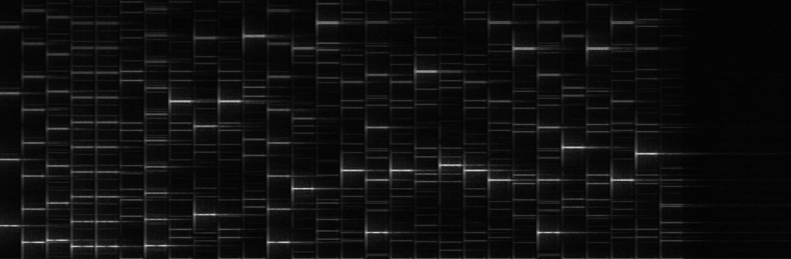

# Baritone

## Challenge Information

| Field | Value |
| --- | --- |
| Category | Misc |
| Points | 470 |
| Handout | [`artifacts/baritone.mp3`](artifacts/baritone.mp3) |
| Interactive writeup | [Baritone — playable piano roll](https://claude.ai/code/artifact/71863bc3-b4c8-46c0-ba07-dc8b8af0d6fc) |
| Flag | `THJCC{DoYouHavePerfectPitch}` |

> A short piece of music. Nothing else.

## TL;DR

The MP3 is a single synthesized melody with **no hidden text in the spectrogram
and nothing in the metadata — the pitches _are_ the message**. Each note is
tuned so that its **MIDI note number equals the ASCII code** of one flag
character. Measure every note's fundamental frequency, convert
Hz → MIDI → ASCII, and the melody reads out
`THJCC{DoYouHavePerfectPitch}`. The title is the whole joke: *Baritone* is a
vocal register, the challenge is about **pitch**, and the decoded sentence asks
whether you have **perfect pitch** — the ability to name a note by ear.

## 1. First Look

```
$ ffprobe baritone.mp3
  Duration: 00:00:16.20, bitrate: 320 kb/s
  Stream #0:0: Audio: mp3, 44100 Hz, stereo, 320 kb/s
  encoder : Lavf62.12.101
```

No suspicious tags, no trailing bytes after the last MP3 frame, and `strings`
turns up nothing. The two channels differ slightly, but not in a way that hides
a second signal — it is just a stereo render of one melody. So this is an
**audio-steganography-by-content** puzzle, not a container trick. Decode it to
PCM to work with the samples:

```bash
ffmpeg -y -i baritone.mp3 -ac 2 -ar 44100 baritone.wav
```

## 2. The Spectrogram: a Piano Roll, Not a Picture

The usual first move for an audio challenge is to render a spectrogram and look
for drawn text. Here there is none — instead you get a **piano roll**: a
sequence of short, clean horizontal tones stepping up and down over time, each
with faint harmonics stacked above it.



Two things stand out:

- The melody is **monophonic** — one note sounds at a time — and each note is a
  clean, near-sinusoidal tone. That means every note has a single, well-defined
  **fundamental frequency**.
- The notes span a **huge range**, from a few hundred Hz up to ~7 kHz. That is
  far wider than any real "baritone" and is the tell that the pitches are
  carrying data rather than making music.

When a melody's *pitches* look deliberate but *tuneless*, the pitch of each note
is almost always the payload.

## 3. The Key Idea: MIDI Note Number = ASCII Code

Standard MIDI numbers each semitone: `A4 = 440 Hz = MIDI 69`, and

```
midi = round(69 + 12 * log2(f / 440))
```

Printable ASCII runs from 32 (space) to 126 (`~`). MIDI 32–126 is a perfectly
playable range of pitches (≈49 Hz to ≈9.4 kHz). So a natural way to "sing" a
byte is to **play the note whose MIDI number equals that byte**:

| char | ASCII | MIDI | note | freq |
| --- | ---: | ---: | --- | ---: |
| `T` | 84 | 84 | C6 | 1046.5 Hz |
| `H` | 72 | 72 | C5 | 523.3 Hz |
| `J` | 74 | 74 | D5 | 587.3 Hz |
| `C` | 67 | 67 | G4 | 392.0 Hz |
| `o` | 111 | 111 | D#8 | 5007.6 Hz |
| `u` | 117 | 117 | A8 | 7040.0 Hz |

Measuring the first note gives ≈1046 Hz → MIDI 84 → ASCII `T`, the next ≈523 Hz
→ 72 → `H`, then ≈587 → `J`, then ≈392 → `C`… i.e. **`THJC…`** — the beginning
of the flag prefix `THJCC{`. That confirms the encoding immediately.

### The one trap: use a wide frequency band

The flag prefix `THJCC` uses uppercase letters (ASCII 67–84 → 392 Hz–1 kHz), but
the *body* of the flag is lowercase letters and could contain digits, `{`, `}`,
or `_` — ASCII **95–125**, which map to MIDI **95–125 ≈ 2 kHz–11 kHz**. If your
pitch detector only searches a narrow "musical" band (say, up to ~1.2 kHz) it
will lock onto a **sub-harmonic** of those high notes and the second half of the
message turns to garbage. Search the fundamental across the full band up to
~13 kHz and every note resolves correctly.

## 4. Reading Every Note

The solver does three things:

1. **Segment** the signal into note events with a simple RMS gate (a note is a
   contiguous run of frames above 15 % of peak loudness).
2. For each event, take the FFT of the steady middle of the note and pick the
   **tallest spectral peak** in 250 Hz–13 kHz (the tones are near-sinusoidal, so
   the tallest peak *is* the fundamental). Parabolic interpolation refines the
   bin to sub-Hz accuracy.
3. Convert `freq → MIDI → chr()` and concatenate.

```
  t0  dur  freq(Hz) midi char
 0.00 0.42   1045.9   84   T
 0.49 0.19    524.4   72   H
 0.99 0.44    588.4   74   J
 1.49 0.23    392.9   67   C     <- 'CC' of the flag prefix (two notes)
 1.99 0.23    392.6   67   C
 3.48 0.45   5003.9  111   o
 3.98 0.45   1395.0   89   Y
 4.48 0.45   5004.0  111   o
 4.99 0.43   7035.5  117   u
 5.99 0.44   2228.4   97   a
 6.49 0.42   7497.0  118   v
 6.99 0.46   2791.9  101   e
 ...
12.99 0.45   3340.3  104   h
```

Read straight down the `char` column:

```
THHJCCCCDDoYouHHavePerfectPitch
```

A few notes are **held/re-struck** and the RMS gate splits them into 2–4 events
(the `HH`, `CCCC`, `DD` runs). Collapsing each run of one repeated pitch to a
single note — while keeping the deliberate double `CC` of the `THJCC` prefix —
gives the clean reading:

```
THJCC  DoYouHavePerfectPitch
```

Wrapping the body in the flag delimiters:

```
THJCC{DoYouHavePerfectPitch}
```

## 5. Solver

[`solve.py`](solve.py) decodes the flag end to end. It only needs `numpy`
(and `ffmpeg` to turn the `.mp3` into a `.wav`; pass a `.wav` and no external
tools are used):

```bash
python3 solve.py artifacts/baritone.mp3
```

```
# raw notes : THHJCCCCDDoYouHHavePerfectPitch
# de-duped  : THJCDoYouHavePerfectPitch

flag: THJCC{DoYouHavePerfectPitch}
```

## Why It Works

- **Frequency, not amplitude, carries the data.** LSB/echo/phase tricks hide
  bits *underneath* the audio; this hides the message *as* the audio — the
  literal pitch of each note is a byte. That is why the spectrogram looks like
  music and why nothing shows up in the file's bytes.
- **MIDI is a clean byte channel.** One semitone per integer means every ASCII
  value 32–126 has a unique, playable pitch, so any printable string can be
  "performed" and read back by ear or by FFT.
- **The title is the specification.** *Baritone* → voice/pitch; the payload is
  the question *"Do you have perfect pitch?"* — someone with perfect pitch could
  literally name the notes and spell the flag without a computer.

## Flag

```text
THJCC{DoYouHavePerfectPitch}
```
